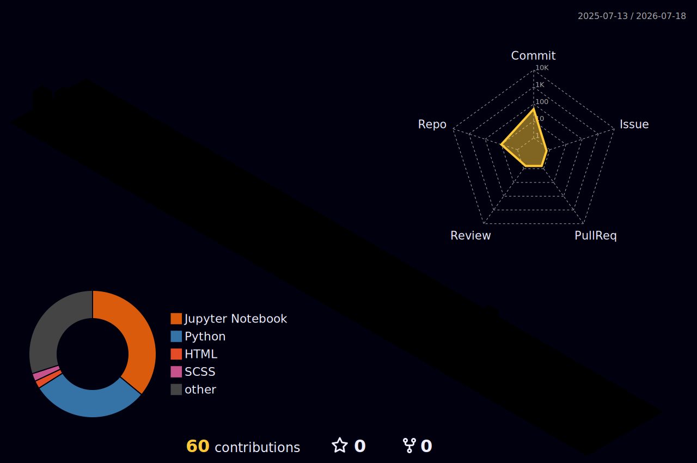

<div align="center">

# Hi, I'm Hassan Kassar 👋

### Finance • Data Analytics • Investment • Technology


<br/>

<a href="https://github.com/KassarHassan">
  
</a>

<a href="https://github.com/KassarHassan?tab=followers">
  
</a>

</div>

---

## 💫 About Me

```python
hassan = {
    "education": "Master's Student in Finance",
    "interests": [
        "Financial Analysis",
        "Investment Research",
        "Financial Modelling",
        "Data Analytics",
        "Financial Technology"
    ],
    "tools": [
        "Python",
        "Power BI",
        "Excel",
        "SQL",
        "R"
    ],
    "goal": "Transform financial data into clear and actionable insights",
    "mindset": "Analyse. Learn. Build. Improve."
}
```

I am a Master's student in Finance with a strong interest in financial analysis, investment, data analytics, and technology.

I enjoy using financial data and analytical tools to investigate real-world problems, identify meaningful trends, and support better business and investment decisions.

* 📊 Developing practical skills in financial modelling and valuation
* 🐍 Using Python for financial analysis, automation, and data visualisation
* 📈 Building interactive reports and dashboards with Power BI
* 💼 Interested in investment research, corporate finance, and fintech
* 🌱 Continuously learning new analytical and technical skills
* 🤝 Open to finance, data, and technology collaborations

---

## 🌐 Connect With Me

<div align="center">

<a href="https://linkedin.com/in/KassarHassan">
  
</a>

<a href="mailto:kassar.hassan@hotmail.com">
  
</a>

<a href="https://medium.com/@KassarHassan">
  
</a>

<a href="https://x.com/KassarHassan">
  
</a>

<a href="https://youtube.com/@KassarHassan">
  
</a>

<a href="https://instagram.com/KassarHassan">
  
</a>

</div>

---

## 💻 Finance & Technology Toolkit

<div align="center">

### Financial Analysis


### Programming & Data


### Analytics & Libraries


### Development Tools


</div>

---

## 🌌 3D Contribution Universe

<div align="center">

<picture>
  <source
    media="(prefers-color-scheme: dark)"
    srcset="./profile-3d-contrib/profile-night-rainbow.svg"
  />
  <source
    media="(prefers-color-scheme: light)"
    srcset="./profile-3d-contrib/profile-green-animate.svg"
  />
  
</picture>

</div>

---

## 🐍 Contribution Snake

<div align="center">

<picture>
  <source
    media="(prefers-color-scheme: dark)"
    srcset="https://raw.githubusercontent.com/KassarHassan/KassarHassan/output/github-contribution-grid-snake-dark.svg"
  />
  <source
    media="(prefers-color-scheme: light)"
    srcset="https://raw.githubusercontent.com/KassarHassan/KassarHassan/output/github-contribution-grid-snake.svg"
  />
  
</picture>

</div>

---

## 📊 GitHub Analytics

<div align="center">

<picture>
  <source
    media="(prefers-color-scheme: dark)"
    srcset="https://github-readme-stats.vercel.app/api?username=KassarHassan&show_icons=true&theme=tokyonight&hide_border=true&include_all_commits=true&rank_icon=github"
  />
  <source
    media="(prefers-color-scheme: light)"
    srcset="https://github-readme-stats.vercel.app/api?username=KassarHassan&show_icons=true&theme=default&hide_border=true&include_all_commits=true&rank_icon=github"
  />
  
</picture>

<picture>
  <source
    media="(prefers-color-scheme: dark)"
    srcset="https://streak-stats.demolab.com?user=KassarHassan&theme=tokyonight&hide_border=true"
  />
  <source
    media="(prefers-color-scheme: light)"
    srcset="https://streak-stats.demolab.com?user=KassarHassan&theme=default&hide_border=true"
  />
  
</picture>

<br/>

<picture>
  <source
    media="(prefers-color-scheme: dark)"
    srcset="https://github-readme-stats.vercel.app/api/top-langs/?username=KassarHassan&layout=compact&theme=tokyonight&hide_border=true&langs_count=8"
  />
  <source
    media="(prefers-color-scheme: light)"
    srcset="https://github-readme-stats.vercel.app/api/top-langs/?username=KassarHassan&layout=compact&theme=default&hide_border=true&langs_count=8"
  />
  
</picture>

</div>

---

## 📈 Contribution Activity

<div align="center">


</div>

---

## 🧭 Developer Dashboard

<div align="center">


<br/>


</div>

---

## 🏆 GitHub Trophies

<div align="center">


</div>

---

## 🔝 Top Contributed Repositories

<div align="center">


</div>

---

## 💡 Quote of the Day

<div align="center">


</div>

---

## ☕ Support My Work

<div align="center">

<a href="https://www.buymeacoffee.com/KassarHassan">
  
</a>

</div>

---

<div align="center">

### Finance provides the questions. Data reveals the answers. Technology creates the solutions.

<br/>


</div>
